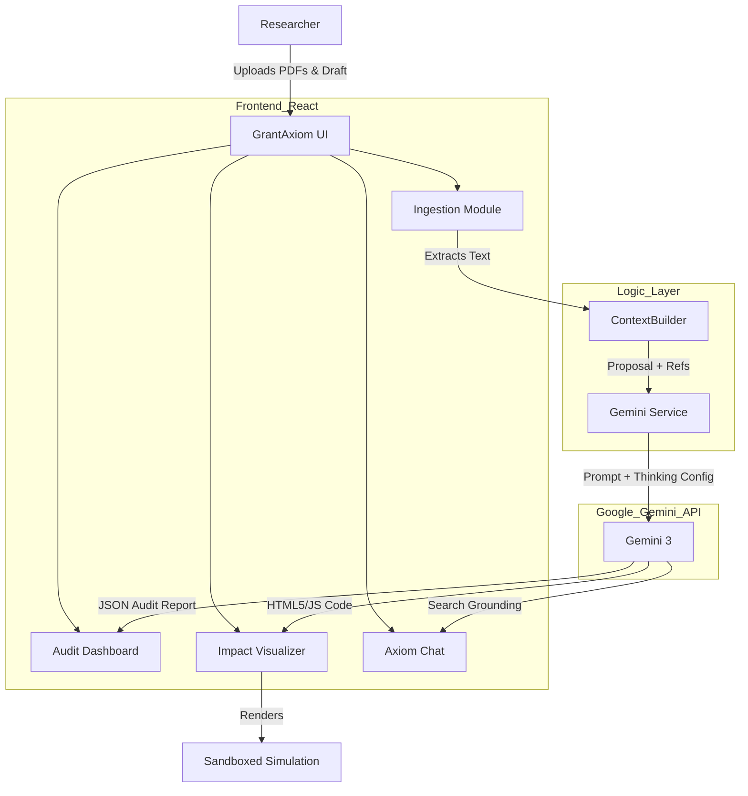

# GrantAxiom 🧪

**The Ultimate AI Auditor & Workbench for Scientific Proposals**

GrantAxiom is an advanced AI-powered application designed to streamline the scientific grant writing process. By leveraging the reasoning capabilities of Google's **Gemini 3**, it acts as a rigorous auditor, a creative visualizer, and a research assistant, helping scientists secure funding with precision.

---

## 🚀 The Problem

Writing scientific grants (NSF, NIH, ERC) is a high-stakes process. Researchers face three major challenges:
1.  **Fact-Checking Hell**: Manually verifying every claim against a library of hundreds of PDF citations is prone to human error.
2.  **Hallucination Risk**: LLMs used for writing often invent citations or misinterpret papers.
3.  **Broader Impact Gap**: Creating compelling "Broader Impacts" materials (educational outreach) is technical and time-consuming.

## 💡 The Solution

GrantAxiom solves these problems by treating the grant proposal as code that needs to be "compiled" and "debugged."

1.  **Ingest**: It reads your draft and your actual PDF reference library.
2.  **Audit**: It uses Gemini's **Thinking Config** to reason deeply about whether your claims are supported by your specific references.
3.  **Visualize**: It instantly generates interactive HTML5 simulations to demonstrate the scientific concepts for educational outreach.

---

## ✨ Key Features

### 1. Context Ingestion Engine
*   **Drag & Drop Library**: Users can upload a library of PDF references (simulated text extraction in this demo).
*   **Draft Editor**: A dedicated space to paste LaTeX or Word drafts of the proposal.
*   **How it works**: The app aggregates the text from uploaded files and the proposal to create a massive context window for the AI model.

### 2. Deep Audit Dashboard (The "Linter" for Science)
*   **Powered by Gemini 2.5 Flash**: Utilizes the model's high speed and **Thinking Budget** to perform multi-step reasoning.
*   **Verification Matrix**:
    *   **🟢 Verified**: Claim is explicitly supported by a specific reference ID.
    *   **🟡 Warning**: Claim is supported but lacks specific citation or nuance.
    *   **🔴 Contradiction**: The claim directly contradicts the provided reference material (Hallucination detection).
*   **Compliance Checks**: Automatically checks for tone, formatting, and standard grant requirements.

### 3. Impact Simulator (Generative Artifacts)
*   **Concept to Code**: Turns abstract scientific methodology into concrete, interactive educational tools.
*   **HTML5/Canvas Generation**: The AI writes complete, self-contained HTML/JS code to visualize the science (e.g., a quantum interference pattern simulator).
*   **Broader Impacts**: Researchers can screenshot or host these simulations to strengthen the "Broader Impacts" section of their proposals.

### 4. Axiom Assistant (Chat)
*   **Context-Aware**: Knows the context of the current proposal.
*   **Google Search Grounding**: Can fetch the latest literature or verify facts using real-time Google Search integration.

---

## 🏗️ Architecture

GrantAxiom is built as a client-side React application that interfaces directly with the Google GenAI SDK.

## 🛠️ Tech Stack

*   **Framework**: React 19 (Vite)
*   **Styling**: Tailwind CSS (Glassmorphism design system)
*   **AI Model**: Google Gemini 3 (`gemini-3`)
*   **AI Features Used**:
    *   **Thinking Config**: For deep reasoning during the audit phase.
    *   **JSON Mode**: For structured data output in the dashboard.
    *   **Code Generation**: For creating the Impact Simulations.
    *   **Search Grounding**: For the chat assistant.
*   **Icons**: Lucide React
*   **Charts**: Recharts
*   **3D Visuals**: Spline Viewer

---

## 📖 How to Use

1.  **Landing**: Click "Get Started" to enter the workbench.
2.  **Context**: 
    *   Paste your grant abstract into the "Draft Proposal" box.
    *   Upload reference text/PDFs in the "Reference Library" section.
    *   Click **"Run Audit"**.
3.  **Audit**:
    *   Review the **Axiom Score**.
    *   Check the **Verification Matrix**. If a claim is red (Contradiction), read the explanation and fix your draft.
4.  **Simulate**:
    *   Navigate to the **Impact Simulator**.
    *   Type a prompt (e.g., "Simulate the effect of X on Y") or let it auto-generate based on your proposal.
    *   Interact with the generated canvas element.
5.  **Chat**: Use the sidebar to ask questions like "Find more papers about X" or "Rewrite this sentence to be more concise."

---

## ⚡ Gemini Integration Details

The project relies heavily on the `gemini-3` model for its balance of speed and reasoning capability.

**Audit Prompting Strategy:**
We inject the reference library as a context block and instruct the model to output a strict JSON schema categorizing claims. We allocate a `thinkingBudget` of 2048 tokens to allow the model to "think" and cross-reference before assigning a verdict.

**Simulation Strategy:**
We prompt the model to act as a "Visualization Engineer" and output raw HTML/JS. We use a higher thinking budget (4096) here to ensure the logic of the simulation code is sound before generation.
